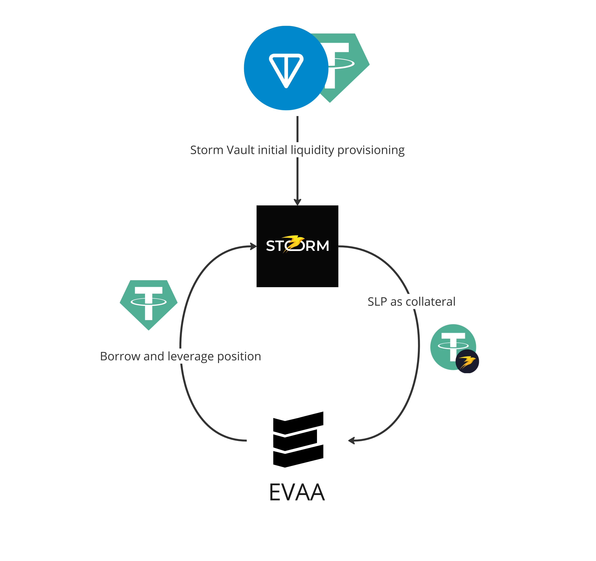

# Stella - Yield Farming Tool on TON blockchain

Stella is a collection of tools that enable different farming strategies on TON, integrating with various decentralized finance protocols

## Leveraged liquidity provisioning with perpetual derivatives and collateralized loans

The first (and for now the only) yield farming strategy is based on `Storm Trade` Vaults and `EVAA` loans protocol.

- [Strategy description with backtests and emulations](/strategy.ipynb)
- [Data scraping](./scripts/collect_vault_data.py)
- [Realisation](./scripts/createLeveragedPosition.ts)
- To launch stategy:

```bash
cp .env.example .env
# Fill env file with RPC key
npm i
npm run strategy:stella
```

- Results:

```
Best Interval:
Start_Date     2024-04-23 22:00:00
End_Date       2024-08-21 22:00:00
Start_Value             1000000000
End_Value               1192638640
APR(%)                   19.263864

Initial position: 10000.00 USD
Leveraged position: 38433.58 USD

Total Strategy Cost: 1151.14 USD

Best profit: 7403.79 USD
Average profit: 5719.66 USD

Net best profit: 6252.65 USD
Net average profit: 4568.52 USD
```



## Future ideas

Next thing I am aiming to implement is hedging impermanent loss from DEX Tokens liquidity provisioning with Options. Two most popular DEX'es on TON, [DeDust](https://dedust.io/) and [StonFi](https://app.ston.fi/), do not support concentrated liquidity yet, but have massive farming boosts from various projects and TF itself. With on-chain options protocol like [TON Hedge](https://tonhedge.com/) it should be possible to implement hedging strategy for Tokens with enough Options liquidity
